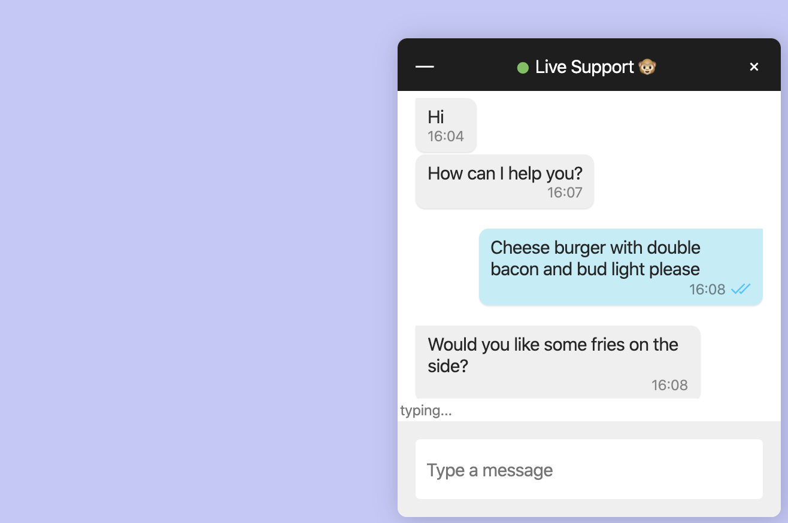

Need a chat box for your website? Want something more independent and affordable than Firebase? In this super simple tutorial, I'll show you how to build a chat using [iris](https://github.com/irislib/iris-lib).

The chat is offline-first and end-to-end encrypted. It is stored and propagated using the distributed database [gun](https://github.com/amark/gun).

No signup of any kind required: just generate a key pair for the chat recipient. Optionally spin up your own free heroku instance to relay messages. **Cost $0**.

# 1. Include gun, sea and iris

* [Gun](https://github.com/amark/gun): a decentralized database
* [Sea](https://gun.eco/docs/SEA): gun's cryptography library
* [Iris](https://github.com/irislib/iris-lib): a library for decentralized social networking

```
<script src="https://cdn.jsdelivr.net/npm/gun/gun.js"></script>
<script src="https://irislib.github.io/iris-messenger/src/js/sea.js"></script>
<script src="https://cdn.jsdelivr.net/npm/iris-lib/dist/iris.min.js"></script>
```

Note: at the time of writing this, sea.js sha-256 is broken on Safari, so you'll need the patched version from the script tag above.

# 2. Initialize gun

```
var gun = new Gun({peers: ['https://gun-eu.herokuapp.com/gun']})
```

You can connect to someone else's gun node, or you can easily [deploy your own](https://github.com/amark/gun#deploy).

# 3. Create a key for the user (chat initiator)

Generate a new key:

```
var key = await iris.Key.generate()
```

Or generate a key and store it in localStorage:

```
var key = await iris.Key.getDefault()
```

# 4. Get the chat recipient's chat link

1. Go to [iris.to](https://iris.to) ([Github mirror](https://irislib.github.io/iris-messenger/src/)).
2. Click "Copy your chat link"
3. Paste:

```
var chatLink = [chat link here]
```

# 5. Add chat button to document

Iris library comes with an embeddable chat button & UI.

```
iris.Chat.addChatButton({label: 'Live Chat', chatOptions: {gun, key, chatLink}});
```

It's as simple as that! Chats opened by users will now show up for the key / account you created at iris.to.

Feel free to inspect the element and override the stylesheet to match your site's look and feel.

# Full example

```
<html>
  <head>
    <title>Live Chat Example</title>
    <meta name="viewport" content="width=device-width, user-scalable=no">
    <script src="https://cdn.jsdelivr.net/npm/gun/gun.js"></script>
    <script src="https://irislib.github.io/iris-messenger/src/js/sea.js"></script>
    <script src="https://cdn.jsdelivr.net/npm/iris-lib/dist/iris.min.js"></script>
  </head>
  <body style="background: #c5c7f7">
    <script type="text/javascript">
      iris.Key.getDefault().then(key => {
        var gun = new Gun({peers: ['https://gun-eu.herokuapp.com/gun']});
        // replace chatLink with your own chat link from iris.to
        var chatLink = 'https://iris.to/?chatWith=4JhaYuPVcq4y2Sp6sRAGkbwM5FdhsMih3b4E6tvd5W4.ULpD5dhra5ojHtKFEdcTZ80UZEmZnRl4dfM2JCEzj2M&s=ZaUbkxPsQeSSdSP1ety7y19eTjPq1gHu15s1v8cbGX4&k=26vMMto5xufO';
        iris.Chat.addChatButton({label: 'Live Chat', chatOptions: {gun, key, chatLink}});
      });
    </script>
  </body>
</html>
```

Check it out on [Codepen](https://codepen.io/mmalmi/pen/bGddeqE) or [Github](https://irislib.github.io/iris-lib/example/chatbox/)

If you want to improve or customize the functionality, addChatButton() source code can be found [here](https://github.com/irislib/iris-lib/blob/master/src/chat.js).

# Notes

Chats are persisted in users' browsers. Heroku nodes are ephemeral: their filesystem is reset once in a while. If you want to persist the chats on a server, you can add S3 storage to your heroku gun instance, or run a docker gun node.

Disclaimer: Messages are e2e encrypted, but message timestamps currently aren't. In a decentralized network the timestamp and message author are visible to anyone. The library has not been security audited, so don't use it for privacy critical purposes.
